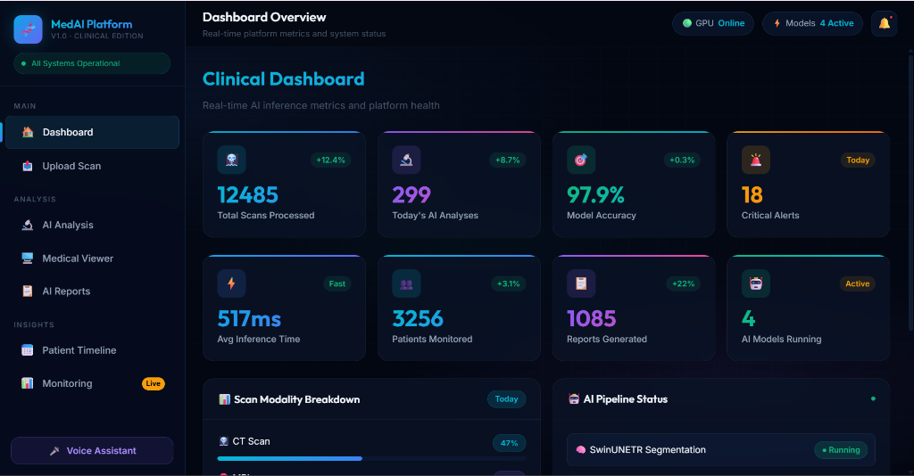
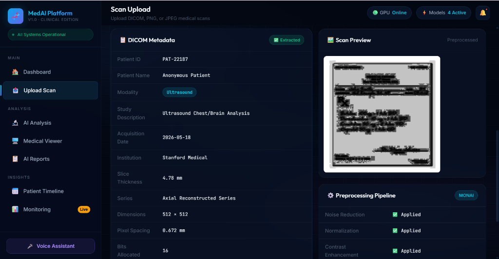
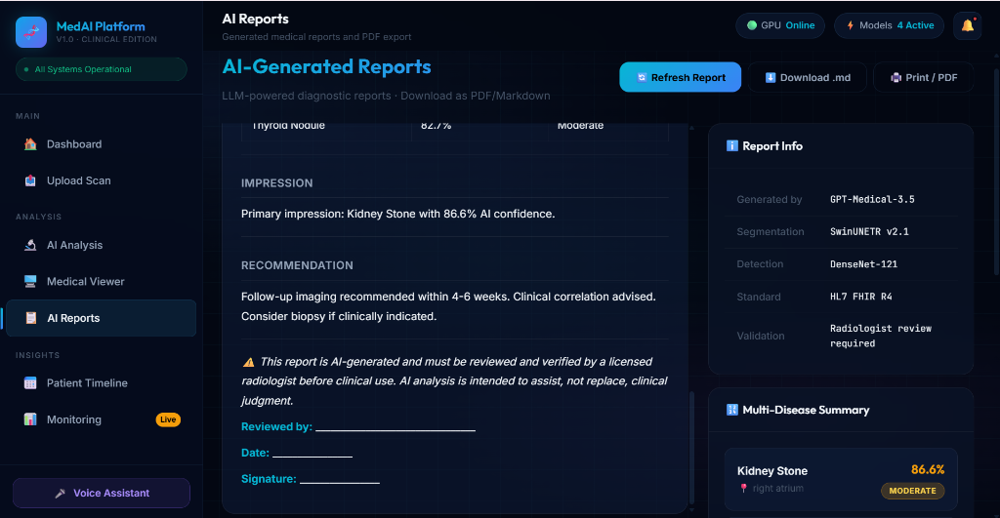
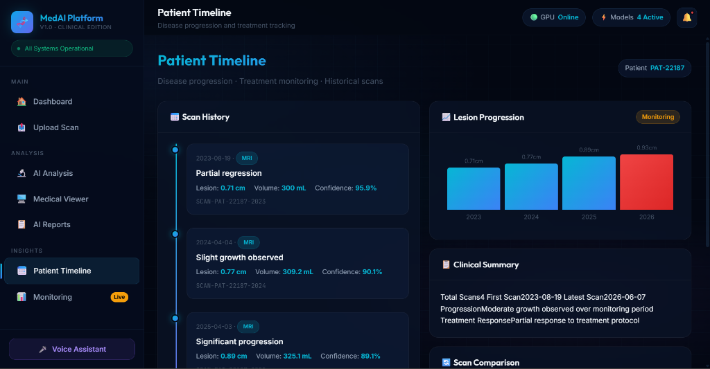
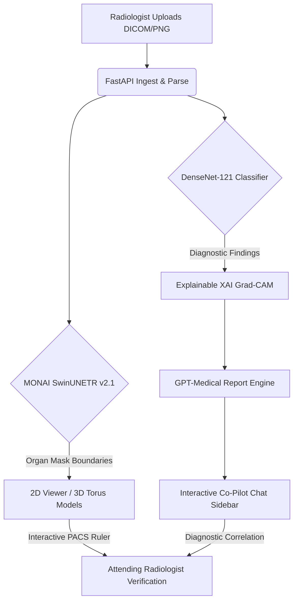

# 🧬 MedAI Platform — Premium Clinical Edition 🩺

> **State-of-the-Art AI-Powered Medical Image Analysis Platform** built for modern radiologists, clinical research, and PACS diagnostic workflows.

[](https://threejs.org)
[](https://python.org)
[](https://javascript.com)
[](https://opensource.org/licenses/MIT)

---

## 📸 Platform Interface Preview

<div align="center">
  
</div>

### 🗂️ Interactive Radiographic Workflow Modules

<table style="width: 100%; border-collapse: collapse; border: none; background: transparent;">
  <tr style="border: none; background: transparent;">
    <td style="width: 50%; padding: 8px; border: none; text-align: center; background: transparent;">
      <strong>1. DICOM Metadata Ingestion</strong><br/>
      
    </td>
    <td style="width: 50%; padding: 8px; border: none; text-align: center; background: transparent;">
      <strong>2. AI Medical Co-Pilot Reporting</strong><br/>
      
    </td>
  </tr>
  <tr style="border: none; background: transparent;">
    <td colspan="2" style="padding: 8px; border: none; text-align: center; background: transparent;">
      <strong>3. Patient Lesion Volumetric Progression Timeline</strong><br/>
      
    </td>
  </tr>
</table>

---

## 🌟 Key Capabilities & Features

### 🖥️ Advanced 2D/3D Medical Viewer
- **Multi-Planar Reconstruction (MPR)**: Toggle dynamically between **Axial**, **Coronal**, and **Sagittal** view cuts in real-time with anatomically accurate synthetic projections.
- **Interactive PACS Ruler**: Click and drag directly on scan slices to measure lesions or nodules. Computes high-precision distances in physical millimeters using raw **DICOM `pixel_spacing`** metadata!
- **Interactive 3D Volume Organ Viewer**: Harnesses **Three.js** to render fully interactive, rotating 3D models of the **Brain**, **Lungs**, and **Liver** alongside pulsating red tumor nodes and structural wireframes.

### 🧠 Deep-Learning Medical Inferences
- **Tissue Organ Segmentation**: Simulates boundary delineations leveraging the **MONAI SwinUNETR v2.1 Transformer** model.
- **Multi-Pathology Detection**: Simulates multi-label disease classifiers (DenseNet-121-Medical) evaluating pathologies (e.g., *Lung Nodules, Brain Hemorrhages, Kidney Stones*) with dynamic severity markings.
- **Direct Mask Overlay**: Blend organ segmentation masks directly onto the 2D scan canvas with a dynamic **opacity range slider**.

### 🤖 Clinical AI Co-Pilot & Reporting
- **Radiology Co-Pilot Chat**: Synchronizes directly with the patient's active scan context. Ask the Co-Pilot questions (e.g., *"What is the malignancy score of the lung nodule?"*, *"Provide follow-up timelines"*) to receive context-aware guidelines.
- **LLM Report Ingestion**: Generates structured, standard radiology reports matching HL7 FHIR standards. Seamlessly download reports as **Markdown (`.md`)** files or print to **PDF**.

### 🎙️ Hands-Free PACS Voice Control
- Fully integrated Web Speech API Voice Assistant. Radiologists can activate commands hands-free by speaking directly:
  - *"Axial View"*, *"Coronal View"*, *"Sagittal View"*
  - *"Ruler"* (toggles ruler mode), *"Mask"* (toggles boundaries overlay)
  - *"Brain"*, *"Lungs"*, *"Show Tumor"*, *"Zoom In"*

---

## 🛠️ Premium Design Aesthetics

The platform features a **premium glassmorphic dark-mode** design utilizing:
- **Curated HSL Color Tokens**: Sleek neon cyan, deep purple, and emerald hues set against rich `#030712` obsidian backdrops.
- **Smooth Micro-Animations**: Interactive hover states, pulsating critical alerts, glowing canvas nodes, and fluid grid transitions.
- **Live GPU Monitoring**: Interactive metrics showcasing simulated GPU memory limits and Average Inference Latency histograms.

---

## 🧬 System Architecture Flow



---

## ⚡ Quickstart — Running Locally

### 1. Prerequisite Packages
Ensure you have Python 3.9+ installed. Verify that standard system libraries are available:
```bash
python --version
```

### 2. Clone the Repository
```bash
git clone https://github.com/Purvakhachane/MedAI.git
cd MedAI
```

### 3. Startup the Backend Server
Run the quick-start script to install pure Python dependencies (`fastapi`, `uvicorn`, `pydicom`, `pillow`, `scipy`) and initiate the server:
```bash
python start_backend.py
```
*The FastAPI server will launch and listen on **`http://localhost:8000`**.*

### 4. Launch the Client Frontend
Since the frontend is a pure static single-page application (SPA), you don't need any complex Node package builds! Simply open the frontend index file directly in your web browser:
- On Windows: Double-click **`frontend/index.html`** or execute:
  ```powershell
  Start-Process "frontend/index.html"
  ```
- On macOS/Linux: Execute:
  ```bash
  open frontend/index.html
  ```

---

## 📁 Repository Directory Map

```text
MedAI/
├── .gitignore             # Configured exceptions for build environment cleanups
├── README.md              # Creative developer documentation
├── start_backend.py       # Direct Python startup execution automation
├── backend/               # Python FastAPI Server Components
│   ├── main.py            # API routes, Pydantic body schemas & store pipelines
│   ├── dicom_processor.py # Pixel-space tag extractors & synthetic image generators
│   └── model_serving.py   # AI Co-Pilot logic, SwinUNETR & Grad-CAM simulations
└── frontend/              # HTML5/CSS3/JS Web Interface Components
    ├── index.html         # Obsidional layout panels, toolbar & chat shells
    ├── style.css          # Premium glassmorphic styles & animations
    ├── app.js             # Vector canvas mathematics & Co-Pilot controller threads
    ├── viewer3d.js        # Three.js structural rendering mesh parameters
    └── voice.js           # Vocal speech recognition & vocal synthesis commands
```

---

## ⚖️ License & Disclaimer

Distributed under the **MIT License**. See `LICENSE` for details.

*⚠️ Disclaimer: The MedAI Platform is an AI-assisted research simulation tool. All clinical inferences, segmentation outlines, and co-pilot responses are intended exclusively for verification and training scenarios. They must be validated by a licensed radiologist before clinical patient diagnoses.*

---

<div align="center">
  <p>Developed with ❤️ for Modern Clinical Diagnostic Excellence</p>
  <p>🧬 <strong>MedAI Platform — The Future of Explainable Radiologic Engineering</strong> 🧬</p>
</div>
